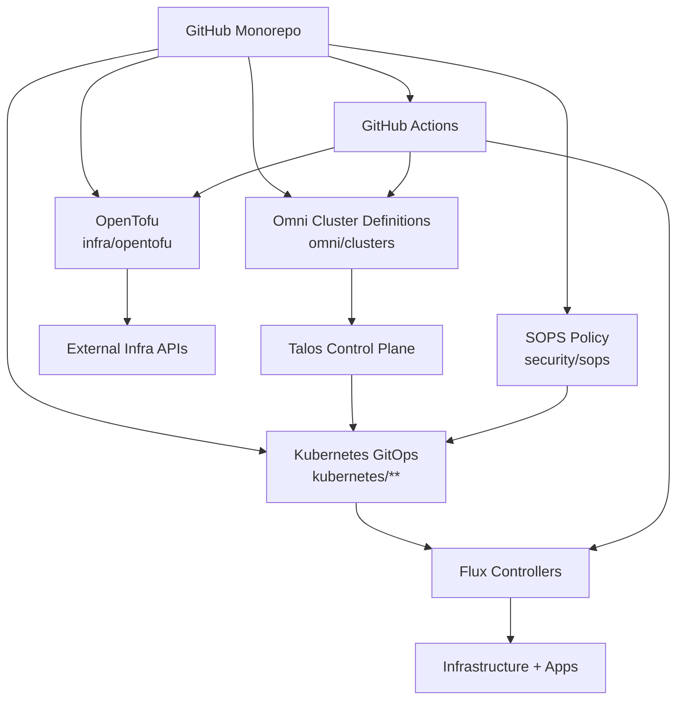

# Homelab Platform Monorepo (Talos + Omni + Flux)

This repository is a **single monorepo** for infrastructure, cluster lifecycle, GitOps, and platform operations.

## Top-level architecture



## Repository layout

- `docs/` — architecture docs, ADRs, and runbooks.
- `infra/opentofu/` — infrastructure as code for external dependencies.
- `omni/clusters/` — Omni cluster lifecycle definitions for Talos.
- `kubernetes/clusters/` — cluster overlays and Flux entrypoints.
- `kubernetes/infrastructure/` — platform controllers and shared infra components.
- `kubernetes/apps/` — tenant and platform applications.
- `security/sops/` — SOPS policy and key management documentation.
- `scripts/` — automation helpers.
- `.github/workflows/` — CI and controlled delivery workflows.

## Quick start

1. Install dependencies: `tofu`, `flux`, `sops`, `age`, `yamllint`, `kustomize`.
2. Review and update TODO markers in this repo.
3. Run local validation:

```bash
make validate
```

## Kubernetes GitOps details

See [kubernetes/README.md](kubernetes/README.md) for the Flux-oriented cluster/infrastructure/app layering and SOPS + age guidance.

## Runbook index

See [docs/runbooks/README.md](docs/runbooks/README.md) for day-2 operations.

## Human input required

- `TODO(platform): define Omni endpoint + credentials workflow.`
- `TODO(platform): set cluster naming, DNS domain, and node inventory.`
- `TODO(security): publish age public key recipients for SOPS.`
- `TODO(gitops): confirm Flux bootstrap target and branch strategy.`
